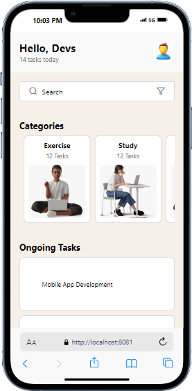

# rn-assignment3-11071517

## Mobile Application Development Assignment 3

*ID:* 11071517

This repository contains the source code for a mobile application developed as part of the DCIT 202 Mobile Application Development course. The application is a task management app, following the design provided in the UI mockup.

## Table of Contents

- [Installation](#installation)
- [Usage](#usage)
- [Components](#components)
- [Screenshots](#screenshots)

## Installation

1. Clone the repository to your local machine:

   ```bash
   git clone https://github.com/kwaffo/rn-assignment3-11071517

## Usage

This application allows users to manage their tasks effectively. It includes features such as viewing categories of tasks, searching tasks, and viewing ongoing tasks.

## Components

### Header

*File:* components/Header.js

* *Usage:* Displays a greeting message and the user's profile picture.
* *Props:* None

### SearchBar

*File:* components/SearchBar.js

* *Usage:* Provides a search input field with a filter icon.
* *Props:* None

### Categories

*File:* components/Categories.js

* *Usage:* Displays a list of task categories that can be scrolled horizontally.
* *Props:* None

### OngoingTasks

*File:* components/OngoingTasks.js

* *Usage:* Displays a list of ongoing tasks.
* *Props:* None

## Screenshots

### Home Screen



*Description:* This screenshot shows the home screen of the application. It includes the header with the greeting message and profile picture, the search bar, the categories section, and the ongoing tasks section.

### Categories Section


*Description:* This screenshot shows the categories section of the application. The categories are displayed horizontally, allowing the user to scroll through different task categories.

### Ongoing Tasks Section


*Description:* This screenshot shows the ongoing tasks section of the application. It lists the tasks that are currently in progress.